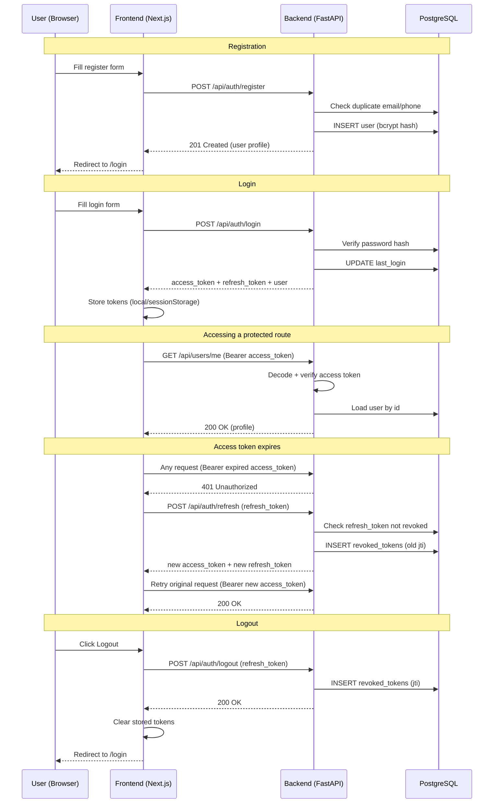

# Authentication API - Testing Reference

Sample requests/responses for every endpoint, the Postman collection, and a
consolidated manual test script. See also `docs/architecture.md` for the
high-level design rationale.

## Authentication flow



## Postman collection

Import `docs/postman-collection.json` into Postman (File -> Import). It
defines three collection variables (`base_url`, `access_token`,
`refresh_token`) and a test script on **Login** and **Refresh Token** that
automatically saves the returned tokens - run requests in this order with no
manual copy-pasting required:

1. Register
2. Login (saves both tokens)
3. Get Current User (Me) (uses the saved access token)
4. Refresh Token (rotates both tokens - running it twice with the same old
   token should fail the second time, which is expected)
5. Logout (revokes the current refresh token)

## Endpoint reference

### POST /api/auth/register

**Request**
```json
{
  "first_name": "Jane",
  "last_name": "Doe",
  "email": "jane@example.com",
  "phone_number": "+919876543210",
  "password": "SecurePass1!",
  "confirm_password": "SecurePass1!"
}
```

**201 Created**
```json
{
  "success": true,
  "message": "Registration successful.",
  "data": {
    "id": "1aea0df8-eda8-4542-8f4f-43a33f598eb9",
    "first_name": "Jane",
    "last_name": "Doe",
    "email": "jane@example.com",
    "phone_number": "+919876543210",
    "role": "customer",
    "is_active": true,
    "is_verified": false,
    "last_login": null,
    "created_at": "2026-08-02T09:15:00Z"
  }
}
```

**409 Conflict** - duplicate email or phone
```json
{ "success": false, "message": "An account with email 'jane@example.com' already exists." }
```

**422 Unprocessable Entity** - weak password (one example; each unmet rule produces its own message)
```json
{ "success": false, "message": "password: Value error, Password must contain at least one uppercase letter." }
```

### POST /api/auth/login

**Request**
```json
{
  "email": "jane@example.com",
  "password": "SecurePass1!"
}
```

**200 OK**
```json
{
  "success": true,
  "message": "Login successful.",
  "data": {
    "access_token": "eyJhbGciOiJIUzI1NiIsInR5cCI6IkpXVCJ9...",
    "refresh_token": "eyJhbGciOiJIUzI1NiIsInR5cCI6IkpXVCJ9...",
    "token_type": "bearer",
    "user": {
      "id": "1aea0df8-eda8-4542-8f4f-43a33f598eb9",
      "first_name": "Jane",
      "last_name": "Doe",
      "email": "jane@example.com",
      "phone_number": "+919876543210",
      "role": "customer",
      "is_active": true,
      "is_verified": false,
      "last_login": "2026-08-19T11:40:00Z",
      "created_at": "2026-08-02T09:15:00Z"
    }
  }
}
```

**401 Unauthorized** - wrong password OR no account with that email (deliberately identical - see below)
```json
{ "success": false, "message": "Incorrect email or password." }
```

**403 Forbidden** - correct credentials, but the account is deactivated
```json
{ "success": false, "message": "This account has been deactivated." }
```

> Wrong password and "no such email" return the exact same 401 message. If
> they differed, this endpoint could be used to check which emails are
> registered (user enumeration) - see `app/core/exceptions.py`.

### GET /api/users/me

**Request** - no body, requires `Authorization: Bearer <access_token>`

**200 OK**
```json
{
  "success": true,
  "message": "User profile retrieved successfully.",
  "data": {
    "id": "1aea0df8-eda8-4542-8f4f-43a33f598eb9",
    "first_name": "Jane",
    "last_name": "Doe",
    "email": "jane@example.com",
    "phone_number": "+919876543210",
    "role": "customer",
    "is_active": true,
    "is_verified": false,
    "last_login": "2026-08-19T11:40:00Z",
    "created_at": "2026-08-02T09:15:00Z"
  }
}
```

**401 Unauthorized** - missing header, malformed token, expired token, or a
refresh token used where an access token is required
```json
{ "success": false, "message": "Could not validate credentials." }
```

**403 Forbidden** - valid access token, but the account has since been deactivated
```json
{ "success": false, "message": "This account has been deactivated." }
```

### POST /api/auth/refresh

**Request**
```json
{ "refresh_token": "eyJhbGciOiJIUzI1NiIsInR5cCI6IkpXVCJ9..." }
```

**200 OK** - a brand new pair; the token used in the request is now revoked
```json
{
  "success": true,
  "message": "Token refreshed successfully.",
  "data": {
    "access_token": "eyJhbGciOiJIUzI1NiIsInR5cCI6IkpXVCJ9...",
    "refresh_token": "eyJhbGciOiJIUzI1NiIsInR5cCI6IkpXVCJ9...",
    "token_type": "bearer"
  }
}
```

**401 Unauthorized** - expired, malformed, wrong token type, already used
(rotation), or belongs to a deactivated/deleted user
```json
{ "success": false, "message": "Refresh token is invalid, expired, or has already been used." }
```

### POST /api/auth/logout

**Request**
```json
{ "refresh_token": "eyJhbGciOiJIUzI1NiIsInR5cCI6IkpXVCJ9..." }
```

**200 OK** - always succeeds, even if the token was already expired/invalid
(the end state the caller wants is already true either way)
```json
{ "success": true, "message": "Logged out successfully.", "data": null }
```

## Manual PowerShell smoke test

Consolidates the individual checks run throughout Milestones 3-8 into one
script. Requires the backend running (`uvicorn app.main:app --reload`) and
Postgres up (`docker ps`).

```powershell
$base = "http://localhost:8000"

# 1. Register
$registerBody = @{
    first_name = "Jane"; last_name = "Doe"; email = "jane@example.com"
    phone_number = "+919876543210"; password = "SecurePass1!"; confirm_password = "SecurePass1!"
} | ConvertTo-Json
try { Invoke-RestMethod -Uri "$base/api/auth/register" -Method Post -Body $registerBody -ContentType "application/json" }
catch { Write-Host "(expected on repeat runs) $($_.ErrorDetails.Message)" }

# 2. Login
$loginBody = @{ email = "jane@example.com"; password = "SecurePass1!" } | ConvertTo-Json
$login = Invoke-RestMethod -Uri "$base/api/auth/login" -Method Post -Body $loginBody -ContentType "application/json"
$accessToken = $login.data.access_token
$refreshToken = $login.data.refresh_token
Write-Host "Login OK - user: $($login.data.user.first_name)"

# 3. Wrong password -> 401, generic message
try {
    $body = @{ email = "jane@example.com"; password = "WrongPassword1!" } | ConvertTo-Json
    Invoke-RestMethod -Uri "$base/api/auth/login" -Method Post -Body $body -ContentType "application/json"
} catch { Write-Host "Wrong password: $($_.ErrorDetails.Message)" }

# 4. Protected route with the real access token
$me = Invoke-RestMethod -Uri "$base/api/users/me" -Method Get -Headers @{ Authorization = "Bearer $accessToken" }
Write-Host "Me OK - email: $($me.data.email)"

# 5. Protected route with no token -> 401
try { Invoke-RestMethod -Uri "$base/api/users/me" -Method Get }
catch { Write-Host "No token: $($_.ErrorDetails.Message)" }

# 6. Refresh (rotates tokens)
$refreshBody = @{ refresh_token = $refreshToken } | ConvertTo-Json
$refreshed = Invoke-RestMethod -Uri "$base/api/auth/refresh" -Method Post -Body $refreshBody -ContentType "application/json"
Write-Host "Refresh OK - new access token issued"

# 7. Reuse the OLD refresh token -> should now fail (rotation worked)
try { Invoke-RestMethod -Uri "$base/api/auth/refresh" -Method Post -Body $refreshBody -ContentType "application/json" }
catch { Write-Host "Old token reuse blocked: $($_.ErrorDetails.Message)" }

# 8. Logout with the current (rotated) refresh token
$currentRefreshToken = $refreshed.data.refresh_token
$logoutBody = @{ refresh_token = $currentRefreshToken } | ConvertTo-Json
Invoke-RestMethod -Uri "$base/api/auth/logout" -Method Post -Body $logoutBody -ContentType "application/json"
Write-Host "Logout OK"

# 9. That same refresh token should no longer work
try { Invoke-RestMethod -Uri "$base/api/auth/refresh" -Method Post -Body $logoutBody -ContentType "application/json" }
catch { Write-Host "Post-logout reuse blocked: $($_.ErrorDetails.Message)" }
```

Expected console output, in order: registration success (or the duplicate
message on repeat runs), login success with the user's name, the wrong
password message, the profile email, the no-token message, refresh success,
the old-token-reuse-blocked message, logout success, and the
post-logout-reuse-blocked message.
